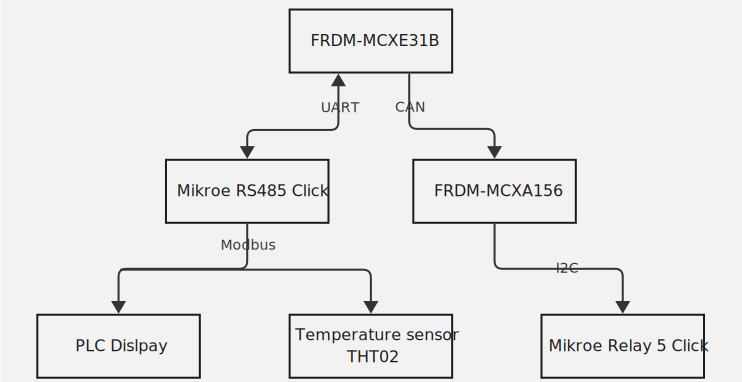
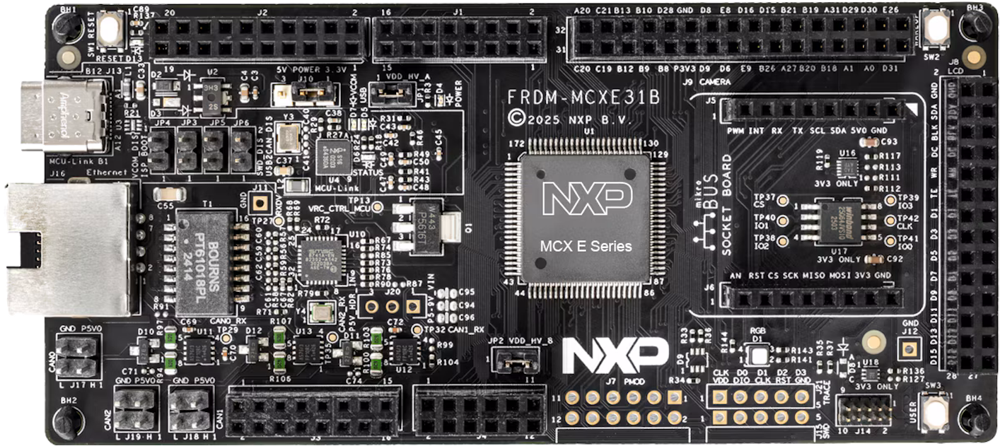
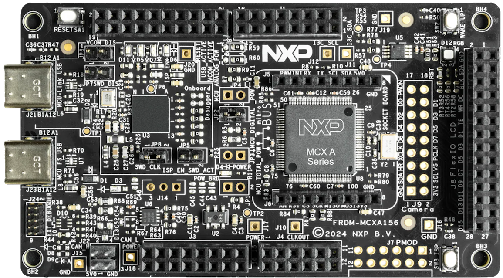
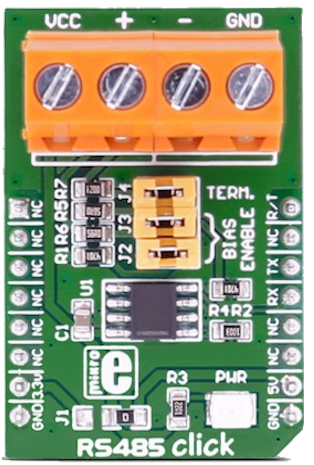
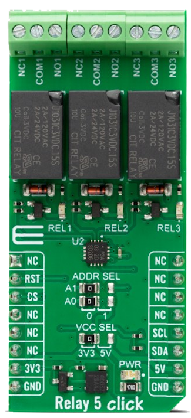
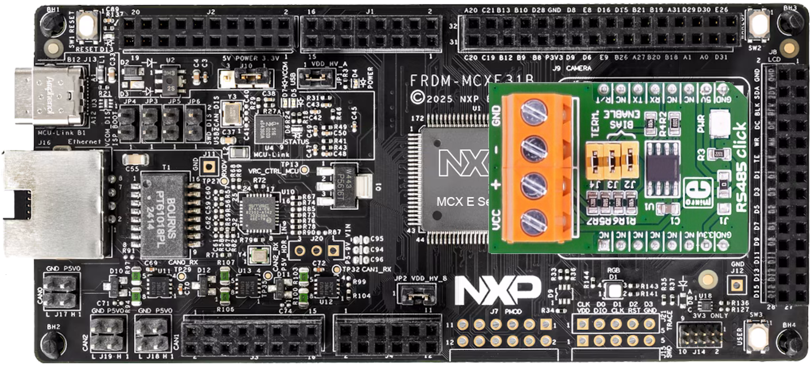
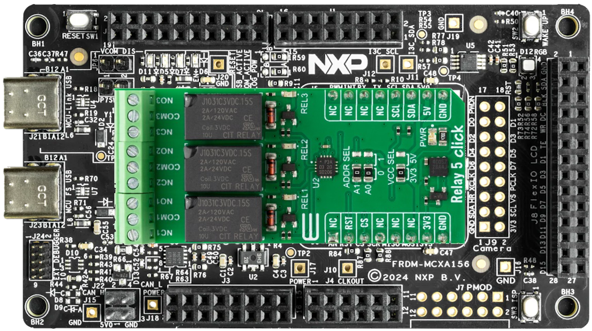
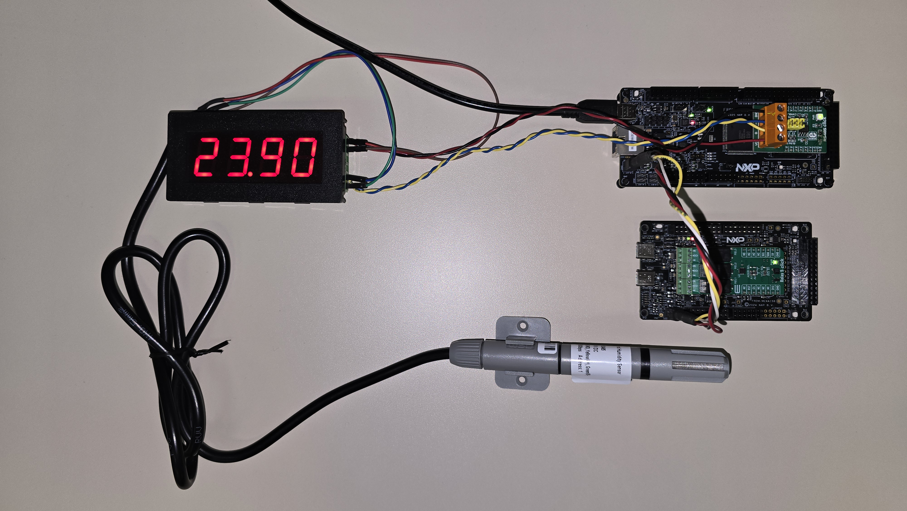

# NXP Application Code Hub
[](https://www.nxp.com)

## Temperature monitor with Modbus and CAN running in zephyr

### Description
<br/>This Zephyr application integrates two development boards, two Mikroe Click modules, and two Modbus-based modules to demonstrate an industrial‑style use case similar to a PLC or PLC peripheral.
<br/>In this example, the FRDM‑MCXE31B uses the Zephyr Modbus stack together with the Mikroe RS485 Click to read a temperature value and control a display that shows the measured temperature. The board also uses a CAN interface to communicate with the FRDM‑MCXA156, which controls a Mikroe Relay 5 Click module.
<br/>The FRDM‑MCXE31B sends commands to the FRDM‑MCXA156 to turn the relay on or off.
It acts as the main controller of the system and provides an interface to configure a temperature threshold that determines the relay’s switching behavior.
<br/>

### Hardware Block diagram
[<p align="center"></p>](./Images/HardwareBlockDiagram.svg)

#### Boards: FRDM-MCXE31B, FRDM-MCXA156
#### Categories: Industrial
#### Peripherals: UART, CAN, GPIO, I2C
#### Toolchains: VS Code

## Table of Contents
1. [Software](#step1)
2. [Hardware](#step2)
3. [Setup](#step3)
4. [Results](#step4)
5. [Release Notes](#step5)

## 1. Software<a name="step1"></a>
- [VSCode (1.107.0)](https://code.visualstudio.com/)
- [MCUXpresso for VSCode extension (25.11.16)](https://marketplace.visualstudio.com/items?itemName=NXPSemiconductors.mcuxpresso)
- [Zephyr version 4.3.0](https://github.com/nxp-mcuxpresso/mcuxsdk-core)

## 2. Hardware<a name="step2"></a>
- [FRDM-MCXE31B](https://www.nxp.com/design/design-center/development-boards-and-designs/general-purpose-mcus/frdm-development-board-for-mcx-e31-mcus:FRDM-MCXE31B)
[<p align="center"></p>](./Images/FRDM_MCX31B.png)

- [FRDM-MCXA156](https://www.nxp.com/design/design-center/development-boards-and-designs/FRDM-MCXA156)
[<p align="center"></p>](./Images/FRDM_MCXA156.png)

- [Mikroe RS485](https://www.mikroe.com/rs485-5v-click?srsltid=AfmBOorZy_Te08sdvNqNo0Vka275rn8DPu7ovM0ZUwROeg4gf4e6enEF)
[<p align="center"></p>](./Images/MikroeRS485Click.png)

- [Mikroe Relay 5 Click](https://www.mikroe.com/relay-5-click?srsltid=AfmBOoqB1w6IcFOGs91x6UqDBWgHsQmjaNTGbnXgIlLvFnI5lFNT1UOC)
[<p align="center"></p>](./Images/MikroeRelay5Click.png)

- [Modbus PLC Display](https://www.amazon.com.mx/Comunicaci%C3%B3n-Modbus-RTU-Pantalla-monitoreo-Industrial/dp/B0DR85DT9K)

- [Temperature Sensor THT02](https://www.onetemp.com.au/product/tzone-tht02-temp-rh-transmitter-rs485/?srsltid=AfmBOopWjmqIOWXtNttOMfiGYG8qWrTGwmnp92BPiy_z0xhIy8b3aNhL)

- Cable for Modbus (For test could be jumpers in short distance)
- Cable for CAN (For test could be jumpers in short distance)
- USB Type-C Cable
- Computer

## 3. Setup<a name="step3"></a>

### 3.1 Prepare before import code
1. [Install VSCode.](https://www.nxp.com/design/design-center/training/TIP-GETTING-STARTED-WITH-MCUXPRESSO-FOR-VS-CODE)
2. [Install MCUXpresso for VSCode extension.](https://www.nxp.com/design/design-center/training/TIP-GETTING-STARTED-WITH-MCUXPRESSO-FOR-VS-CODE)

### 3.2 Import example from Application Code Hub
1. Open MCUXpresso for VSCode extension.
2. In Quick Start Panel window click in Application Code Hub.
3. In Search text field, type the name of this example "Temperature monitor with Modbus and CAN running in zephyr".
4. Select the example, update the name and select the directory where the example will be saved.

[**NOTE: If Zephyr repository is already cloned click here for more information**](https://github.com/nxp-appcodehub/dm-create-zephyr-app-repo)

5. Click in Import Project and wait some minutes.
6. If window appears in top side of VSCode select both projects and wait.
7. Now, the projects of demo should be in Pojects panel.

### 3.3 Prepare Mikroe RS485 Click
1. Move J1 resistor to right side, like next image.
[<p align="center"></p>](./Images/MikroeRS485Click.png)

### 3.4 Prepare FRDM-MCXE31B
1. Set J10 to 2-3 position to move power of MCU to 5V.
2. Plug Mikroe RS485 Click in Mikroe header of FRDM-MCXE31B.
[<p align="center"></p>](./Images/MCXE31B_RS485Click.png)

### 3.5 Prepare FRDM-MCXA156
1. Plug Mikroe RS485 Click in Mikroe header of FRDM-MCXA156.
[<p align="center"></p>](./Images/MCXA156_Relay5Click.png)

### 3.6 Connect Modbus Devices
1. Connect VCC of Mikroe RS485 Click to VCC of temperature sensor and VCC of display.
2. Connect GND of Mikroe RS485 Click to GND of temperature sendor and GND of display.
3. Connect "+" of Mikroe RS485 Click to "A+" of temperature sensor and "D+" of display.
4. Connect "-" of Mikroe RS485 Click to "B-" of temperature sensor and "D-" of display.

### 3.7 Connect CAN Bus
1. Connect CAN0 connector of FRDM-MCXE31B to CAN connector of FRDM-MCXA156. Connect 5V with 5V, GND with GND, CAN_H with CAN_H and CAN_L with CAN_L.

### 3.8 Move configuration of modbus zephyr stack for specific modbus devices
In this case the temperature sensor and display don't need parity bit and only use one stop bit. This is different in modbus zephyr stack.
1. With File explorer open the path where zephyr repository was downloaded.
2. Go to path /nxp_zephyr/zephyr/subsys/modbus/
3. Open modbus_serial.c
4. Click "Ctrl + F" and in emergent window search
```
case UART_CFG_PARITY_NONE:
```
5. Here change stop bit configuration of 2 to 1. 
```
uart_cfg.stop_bits = UART_CFG_STOP_BITS_1;
```
6. Save the file ("Ctrl + S")

### 3.9 Flash the FRDM-MCXE31B Application
1. Connect FRDM-MCXE31B to computer with USB-C cable in MCU-Link (J13).
2. Open MCUXpresso extension in VSCode.
3. Select the project "dm-modbus-can-temp-monitor-frdm-mcxe31b".
4. Do right click on project and select pristine build and wait about a one minute.
5. Click run (play icon).
6. Please wait a few seconds.
7. Now click stop in center upper button.

### 3.10 Flash the FRDM-MCXA156 Application
1. Connect FRDM-MCXA156 to computer with USB-C cable in MCU-Link (J21).
2. Open MCUXpresso extension in VSCode.
3. Select the project "dm-modbus-can-temp-monitor-frdm-mcxa156".
4. Do right click on project and select pristine build and wait about a one minute.
5. Click run (play icon).
6. Please wait a few seconds.
7. Now click stop in center upper button.

## 4. Results<a name="step4"></a>
[<p align="center"></p>](./Images/Result.jpg)

#### Project Metadata

<!----- Boards ----->
[](https://www.nxp.com/design/design-center/development-boards-and-designs/general-purpose-mcus/frdm-development-board-for-mcx-e31-mcus:FRDM-MCXE31B)
[](https://www.nxp.com/design/design-center/development-boards-and-designs/FRDM-MCXA156)

<!----- Categories ----->
[](https://mcuxpresso.nxp.com/appcodehub?category=industrial)

<!----- Peripherals ----->
[](https://mcuxpresso.nxp.com/appcodehub?peripheral=uart)
[](https://mcuxpresso.nxp.com/appcodehub?peripheral=can)
[](https://mcuxpresso.nxp.com/appcodehub?peripheral=gpio)
[](https://mcuxpresso.nxp.com/appcodehub?peripheral=i2c)

<!----- Toolchains ----->
[](https://mcuxpresso.nxp.com/appcodehub?toolchain=vscode)

Questions regarding the content/correctness of this example can be entered as Issues within this GitHub repository.

>**Warning**: For more general technical questions regarding NXP Microcontrollers and the difference in expected functionality, enter your questions on the [NXP Community Forum](https://community.nxp.com/)

[](https://www.youtube.com/NXP_Semiconductors)
[](https://www.linkedin.com/company/nxp-semiconductors)
[](https://www.facebook.com/nxpsemi/)
[](https://x.com/NXP)

## 5. Release Notes<a name="step5"></a>
| Version | Description / Update                           | Date                          |
|:-------:|------------------------------------------------|------------------------------:|
| 1.0     | Initial release on Application Code Hub        |   March 20<sup>th</sup> 2026  |

## Licensing

Trademarks and Service Marks: There are a number of proprietary logos, service marks, trademarks, slogans and product designations ("Marks") found on this Site. By making the Marks available on this Site, NXP is not granting you a license to use them in any fashion. Access to this Site does not confer upon you any license to the Marks under any of NXP or any third party's intellectual property rights. While NXP encourages others to link to our URL, no NXP trademark or service mark may be used as a hyperlink without NXP’s prior written permission. The following Marks are the property of NXP. This list is not comprehensive; the absence of a Mark from the list does not constitute a waiver of intellectual property rights established by NXP in a Mark.
NXP, the NXP logo, NXP SECURE CONNECTIONS FOR A SMARTER WORLD, Airfast, Altivec, ByLink, CodeWarrior, ColdFire, ColdFire+, CoolFlux, CoolFlux DSP, DESFire, EdgeLock, EdgeScale, EdgeVerse, elQ, Embrace, Freescale, GreenChip, HITAG, ICODE and I-CODE, Immersiv3D, I2C-bus logo , JCOP, Kinetis, Layerscape, MagniV, Mantis, MCCI, MIFARE, MIFARE Classic, MIFARE FleX, MIFARE4Mobile, MIFARE Plus, MIFARE Ultralight, MiGLO, MOBILEGT, NTAG, PEG, Plus X, POR, PowerQUICC, Processor Expert, QorIQ, QorIQ Qonverge, RoadLink wordmark and logo, SafeAssure, SafeAssure logo , SmartLX, SmartMX, StarCore, Symphony, Tower, TriImages, Trimension, UCODE, VortiQa, Vybrid are trademarks of NXP B.V. All other product or service names are the property of their respective owners. © 2021 NXP B.V.